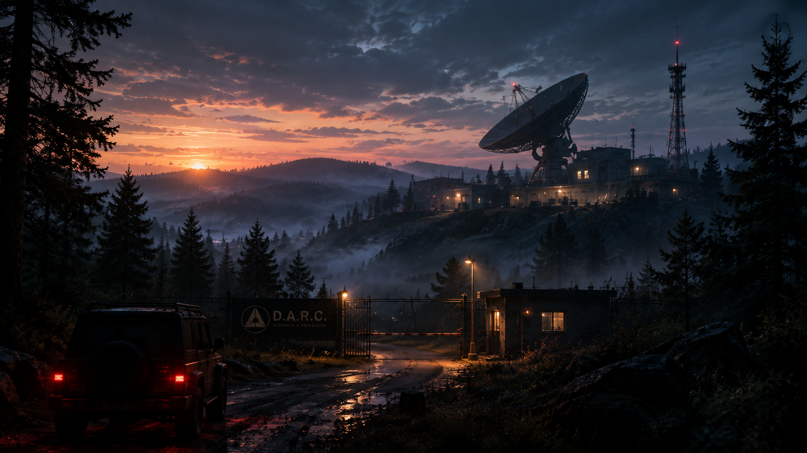

# Миссия 1 (срез) — визуальный референс

Главный кадр — **подъезд к КПП**: игроки появляются у своей машины и видят ворота, будку
и комплекс на холме. С этого кадра начинается выезд — он задаёт настроение всей игры.

## Что на картинке и как это сделано в срезе

| На референсе | В срезе (`ADarcSliceBuilder::BuildExterior` / `BuildEnvironment`) | Чем заменить потом |
|---|---|---|
| Солнце садится за холмы слева, небо сиреневое | солнце у горизонта впереди слева (pitch -3°), оранжевое; атмосфера неба | — |
| Туман в низинах | низкий холодный объёмный туман, тёплый у солнца | — |
| Лес из елей | ~220 серых «елей» (ствол + 2 конуса), одинаковые у всех игроков | модели елей (Megaplant/Fab), слот пока не заведён |
| Холмы на горизонте | тёмные сплюснутые сферы в тумане | ландшафт |
| Грунтовая мокрая дорога | полоса, слот `Road` | материал мокрой грязи с лужами |
| Забор-сетка, ворота, шлагбаум | столбы + панели (слот `Fence`), створки открыты, красно-белая стрела | сетка-рабица |
| Вывеска D.A.R.C. | тёмный щит, текст из String Table (`Sign_DarcName`, `Sign_DarcSub`) | декаль/материал с текстом (по правилам — не запекать текст в текстуру) |
| Будка с тёплым окном | будка (слот материала `Booth`), окно светится | модель будки |
| Натриевый фонарь у ворот | `ADarcPowerLamp` с `bStreetLight` — тёплый, на цепи `Building` | модель фонаря, слот `StreetLamp` |
| Радиотелескоп | опора + наклонённая «чаша» + облучатель с красным огнём | модель, слот `SatelliteDish` |
| Вышка с красными огнями | 4 сходящиеся опоры, 3 мигающих огня | модель вышки |
| Внедорожник с горящими стоп-сигналами | тёмный бокс-силуэт, красные огни | модель машины |
| Здание с тёплыми окнами | бетонные внешние стены (слот `WallOutside`) | окна с тёплым светом изнутри |

## Палитра

- Небо: от оранжево-розового у горизонта к сине-фиолетовому вверху.
- Тени и лес: почти чёрные, холодные, с зелёным оттенком.
- Акценты: натриевый оранжевый (фонари, окна) и сигнальный красный (вышка, стоп-сигналы).
- Белых и ярких поверхностей в кадре нет — всё приглушено сумерками.
